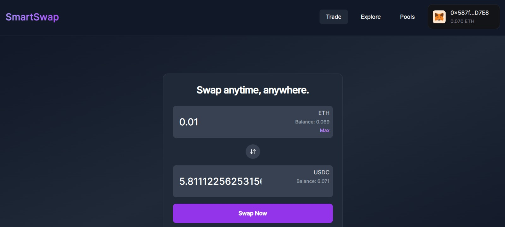
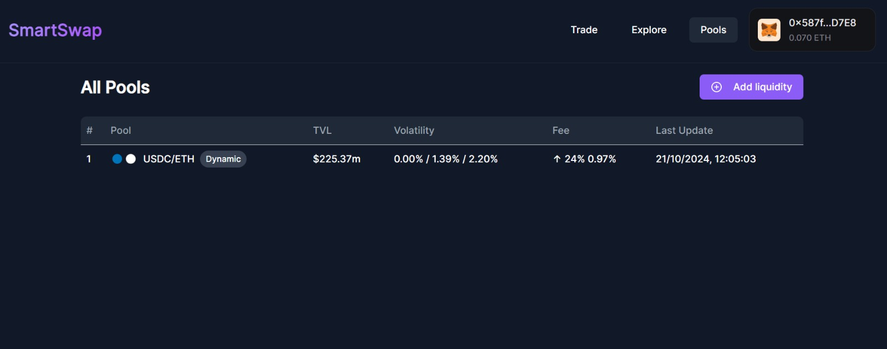

# Smartswap

## Table of Contents
- [Problem Statement](#problem-statement)
- [Solution](#solution)
- [Unique Features](#unique-features)
- [Getting Started](#getting-started)
- [Images of Our Product](#here-are-some-images-of-our-product)
- [YouTube Video](#link-to-our-youtube-video)

## Problem Statement
Traditional decentralized exchanges (DEXs) based on Automated Market Makers (AMMs) expose liquidity providers (LPs) to significant risks during periods of high market volatility, including impermanent loss, loss versus rebalancing (LVR), and arbitrage exploitation. Existing solutions lack real-time adaptive mechanisms to protect LPs, optimize trade execution, and maintain market efficiency, leading to reduced liquidity and participant trust in volatile conditions.

## Solution
Fnatic revolutionizes the decentralized exchange (DEX) model by integrating machine learning-driven dynamic fee adjustments and on-chain AI trading agents. The platform uses real-time volatility data from a volatility oracle to dynamically adjust trading fees, protecting liquidity providers (LPs) from impermanent loss and discouraging arbitrage activity during high market volatility. Additionally, Fnatic employs five on-chain AI trading agents, each specializing in sentiment analysis, technical analysis, and fundamental analysis, to automate trading strategies and enhance market liquidity. These agents operate based on diverse risk profiles, enabling them to adapt intelligently to changing market conditions. With a focus on improving liquidity provision, reducing market inefficiencies, and ensuring fair pricing, Fnatic provides a more resilient and efficient trading environment for all participants.

## Unique Features
- **Dynamic Fee Structure**: Unlike traditional DEXs, Smartswap adjusts fees based on volatility, ensuring that users only pay for what they need.
- **On-Chain AI Trading Agents**: Five automated trading agents that leverage sentiment, technical, and fundamental analysis to execute trades and improve market efficiency.
- **Liquidity Provider Protection**: Reduces impermanent loss and LVR by dynamically adjusting fees and managing LP risk during volatile conditions.
- **Predictive Analytics**: Machine learning model predicts optimal fee structures to adapt to real-time market conditions.
- **Real-Time Market Adaptation**: AI agents continuously monitor and execute strategies based on live market data, ensuring the platform adapts to changing conditions.
- **High Liquidity and Reduced Slippage**: Increased automation and intelligent trading strategies ensure better liquidity and lower slippage for trades.
- **Cross-Chain Compatibility**: Leveraging Chainlink's CCIP for seamless communication across different blockchain networks, enhancing liquidity and user access.

## Getting Started
To run the Smartswap project locally, follow these steps:

1. **Clone the Repository**:
   ```bash
   git clone <repository-url>
   cd fnatic-unfold
   cd fnatic-app
    ```
2. **Install Dependencies**:
   ```bash
    npm install
    ```

3. **Update Config**:
   1. Add the contract addresses that we have deployed. 
   2. Add Configurations mentioned in .env.example
 <br>

4. **Start the dev Server**
    ```bash
    npm run dev
    ```
### Here are some of the images of our Product 
 






 

 

## Link to our Youtube Video

